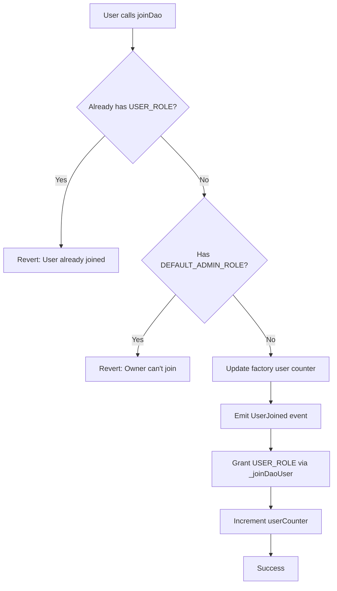

## Overview

The `AgoraDao` contract represents an individual DAO instance within the Agora ecosystem. It inherits from the `Rol` abstract contract to provide role-based access control. Each DAO is created by the `AgoraDaoFactory` and manages its own members, roles, and user participation.

**Contract:** `AgoraDao.sol`  
**Inherits:** `Rol` (which extends OpenZeppelin's `AccessControl`)  
**Author:** NightmareFox12

## State Variables

### Core Variables

```solidity
address public fabric;
uint256 public daoID;
uint256 public userCounter;
string[] internal daoCategories;
```

<ResponseField name="fabric" type="address">
  Address of the parent AgoraDaoFactory contract
</ResponseField>

<ResponseField name="daoID" type="uint256">
  Unique identifier for this DAO (assigned by factory)
</ResponseField>

<ResponseField name="userCounter" type="uint256">
  Number of users who have joined this specific DAO
</ResponseField>

<ResponseField name="daoCategories" type="string[]">
  Internal storage for DAO categories
</ResponseField>

## Constructor

Initializes a new DAO instance.

```solidity
constructor(address _fabric, address _creator)
```

<ParamField path="_fabric" type="address" required>
  Address of the AgoraDaoFactory contract that created this DAO
</ParamField>

<ParamField path="_creator" type="address" required>
  Address of the user creating the DAO (granted DEFAULT_ADMIN_ROLE)
</ParamField>

**Initialization Process:**
1. Stores the factory contract address
2. Grants `DEFAULT_ADMIN_ROLE` to the creator
3. Initializes `userCounter` to 1 (counting the creator)

## Functions

### joinDao

Allows a user to join the DAO as a regular member.

```solidity
function joinDao() external
```

**Requirements:**
- User must not already have the `USER_ROLE`
- User cannot be the DAO creator (DEFAULT_ADMIN_ROLE)

**Process:**
1. Validates that the user hasn't already joined
2. Validates that the caller is not the owner
3. Calls the factory's `addUserCounter` to update global user count
4. Emits `UserJoined` event
5. Calls internal `_joinDaoUser` to grant USER_ROLE
6. Increments the DAO's `userCounter`

**Example:**

```solidity
// User joins a DAO
agoraDao.joinDao();
```

**Error Cases:**

```solidity
// Fails if user already joined
require(!hasRole(USER_ROLE, msg.sender), "User already joined");

// Fails if owner tries to join
require(!hasRole(DEFAULT_ADMIN_ROLE, msg.sender), "The owner can't join");
```

## Events

### UserJoined

Emitted when a user successfully joins the DAO.

```solidity
event UserJoined(address indexed user, uint256 userID);
```

<ResponseField name="user" type="address" indexed>
  Address of the user who joined
</ResponseField>

<ResponseField name="userID" type="uint256">
  The user counter value when they joined
</ResponseField>

## Interface to Factory

### IAgoraDaoFactory

The AgoraDao contract interacts with its parent factory through this interface.

```solidity
interface IAgoraDaoFactory {
    function addUserCounter(address _user) external;
}
```

This interface allows the DAO to notify the factory when new users join, enabling the factory to maintain accurate global user statistics.

## Role System Integration

The `AgoraDao` inherits all role management functionality from the `Rol` abstract contract:

### Available Roles

From the `Rol` contract:
- `DEFAULT_ADMIN_ROLE`: DAO creator/administrator
- `USER_ROLE`: Regular DAO members
- `AUDITOR_ROLE`: Members who can manage other roles
- `TASK_MANAGER_ROLE`: Members who can manage tasks
- `PROPOSAL_MANAGER_ROLE`: Members who can manage proposals

### Role Management Functions

Inherited from `Rol`:
- `registerRole(bytes32 _role, address _user)`: Assign a role to a user
- `registerRoleBatch(bytes32 _role, address[] _users)`: Assign role to multiple users
- `deleteRole(bytes32 _role, address _user)`: Remove a role from a user
- `getMemberByRole(bytes32 _role)`: Get all members with a specific role
- `isRole(bytes32 _role, address _user)`: Check if a user has a role

See the [Role System](/contracts/role-system) documentation for complete details.

## Usage Example

```solidity
// DAO is created by factory
AgoraDao dao = new AgoraDao(factoryAddress, creatorAddress);

// User joins the DAO
dao.joinDao();

// Check if user has joined
bool isUser = dao.hasRole(dao.USER_ROLE(), userAddress);

// Admin assigns auditor role
dao.registerRole(dao.AUDITOR_ROLE(), auditorAddress);

// Get all users in the DAO
address[] memory users = dao.getMemberByRole(dao.USER_ROLE());

// Get user counter
uint256 totalUsers = dao.userCounter();
```

## Receive Function

The contract can receive Ether directly:

```solidity
receive() external payable {}
```

This allows the DAO to accept Ether transfers for treasury management or other purposes.

## Access Control Flow



## Integration Points

### With AgoraDaoFactory

- Created by factory's `createDao()` function
- Reports new users back to factory via `addUserCounter()`
- Factory stores DAO metadata and address

### With Rol System

- Extends `Rol` abstract contract
- Inherits all role management capabilities
- Uses `_joinDaoUser()` internal function for user onboarding
- Leverages OpenZeppelin's AccessControl for permissions