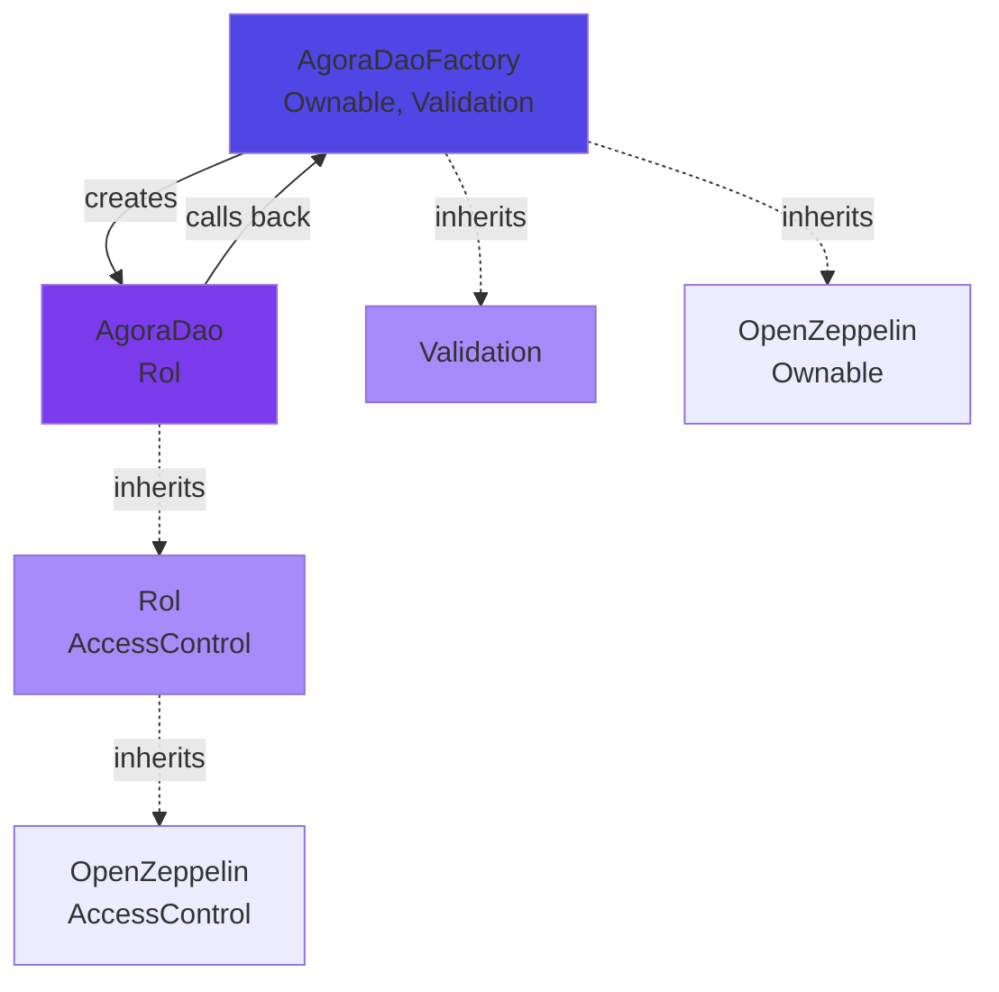
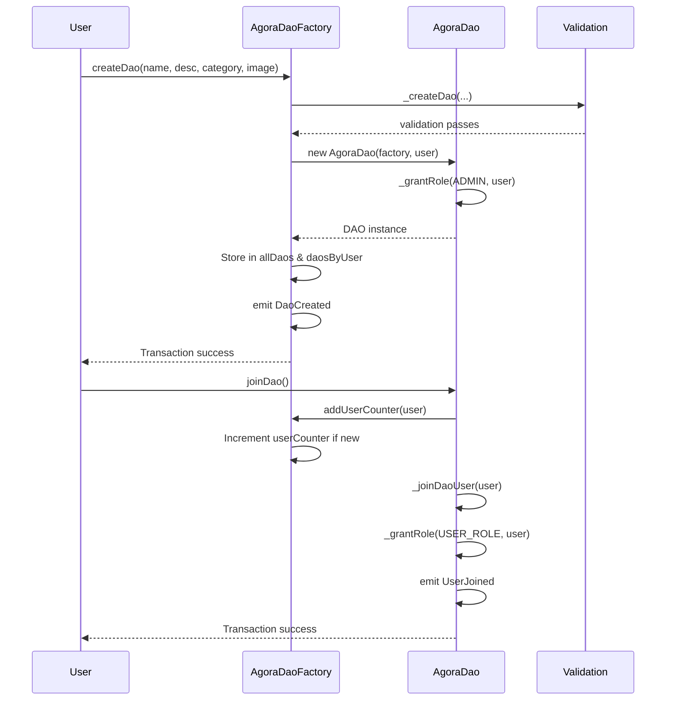

The Agora DAO smart contract system uses a factory pattern with modular inheritance to separate concerns and enable code reuse.

## Factory pattern

The system uses the factory pattern to create standardized DAO instances:

1. **Factory contract** (`AgoraDaoFactory`) deploys new DAO instances
2. **Product contract** (`AgoraDao`) represents individual DAOs
3. **Registry** tracks all deployed DAOs for discovery

```solidity Factory creates DAOs
// In AgoraDaoFactory.sol:63
function createDao(
    string memory _name,
    string memory _description,
    uint256 _categoryID,
    string memory _imageURI
) external {
    // Create new DAO contract instance
    AgoraDao createdDaoContract = new AgoraDao(address(this), msg.sender);

    // Store in registry
    allDaos.push(newDao);
    daosByUser[msg.sender].push(newDao);
    isDao[address(createdDaoContract)] = true;
}
```

### Benefits of factory pattern

<CardGroup cols={2}>
  <Card title="Consistency" icon="check">
    Every DAO is deployed with the same code and proper initialization
  </Card>
  <Card title="Discovery" icon="magnifying-glass">
    Factory maintains a registry of all DAOs for easy discovery
  </Card>
  <Card title="Upgradability" icon="arrows-rotate">
    Future versions can deploy new DAO implementations while maintaining the registry
  </Card>
  <Card title="Gas efficiency" icon="gas-pump">
    Users only deploy the lightweight DAO contract, not the full factory logic
  </Card>
</CardGroup>

## Contract relationships

The system consists of four contracts with clear relationships:



### AgoraDaoFactory relationships

**Inherits from:**
- `Ownable` (OpenZeppelin) - Provides single owner with admin privileges
- `Validation` - Provides input validation for DAO creation

**Creates:**
- `AgoraDao` instances via the `new` keyword

**Stores:**
- Array of all DAOs (`allDaos`)
- Mapping of DAOs by creator (`daosByUser`)
- Mapping to verify DAO authenticity (`isDao`)

```solidity From AgoraDaoFactory.sol:15
contract AgoraDaoFactory is Ownable, Validation {
    uint256 public userCounter;
    uint256 public daoCounter;
    Dao[] public allDaos;
    
    mapping(address => Dao[]) public daosByUser;
    mapping(address => bool) internal isDao;
}
```

### AgoraDao relationships

**Inherits from:**
- `Rol` - Provides complete role-based access control system

**References:**
- `fabric` - Stores parent factory address for callbacks
- Calls `IAgoraDaoFactory.addUserCounter()` when users join

**State:**
- Creator automatically receives `DEFAULT_ADMIN_ROLE`
- Tracks member count via `userCounter`

```solidity From AgoraDao.sol:17
contract AgoraDao is Rol {
    address public fabric;
    uint256 public daoID;
    uint256 public userCounter;

    constructor(address _fabric, address _creator) {
        fabric = _fabric;
        _grantRole(DEFAULT_ADMIN_ROLE, _creator);
        userCounter++;
    }
}
```

## Inheritance structure

### Rol inheritance

The `Rol` contract (`contracts/AgoraDao/Rol.sol:6`) inherits from OpenZeppelin's `AccessControl`:

```solidity
abstract contract Rol is AccessControl {
    bytes32 internal constant AUDITOR_ROLE = keccak256("AUDITOR_ROLE");
    bytes32 internal constant TASK_MANAGER_ROLE = keccak256("TASK_MANAGER_ROLE");
    bytes32 internal constant PROPOSAL_MANAGER_ROLE = keccak256("PROPOSAL_MANAGER_ROLE");
    bytes32 internal constant USER_ROLE = keccak256("USER_ROLE");
    
    mapping(bytes32 => address[]) private roleUsers;
    mapping(bytes32 => mapping(address => bool)) private isMemberOfRole;
}
```

**Inherited from AccessControl:**
- `hasRole(bytes32 role, address account)` - Check if account has role
- `_grantRole(bytes32 role, address account)` - Grant role to account
- `_revokeRole(bytes32 role, address account)` - Revoke role from account
- `DEFAULT_ADMIN_ROLE` - Built-in admin role

**Extended by Rol:**
- Role enumeration via `roleUsers` mapping
- Batch role assignment via `registerRoleBatch()`
- Role deletion with array compaction
- Additional permission checks for role assignment

### Validation inheritance

The `Validation` contract (`contracts/AgoraDaoFactory/Validation.sol:4`) is a pure utility contract:

```solidity
abstract contract Validation {
    function _createDao(
        string memory _name,
        string memory _description,
        uint256 _categoryID,
        string[] memory _daoCategories
    ) internal virtual {
        require(bytes(_name).length > 0, "Dao name must not be empty");
        require(bytes(_name).length <= 50, "The name of the DAO is very long");
        require(bytes(_description).length > 0, "DAO description must not be empty");
        require(bytes(_description).length <= 500, "The description of the DAO is very long");
        require(_categoryID < _daoCategories.length, "Invalid category ID.");
    }
}
```

No state variables or external dependencies - purely validation logic.

## State variables and mappings

### AgoraDaoFactory state

<AccordionGroup>
  <Accordion title="Counters">
    ```solidity
    uint256 public userCounter;  // Total unique users across all DAOs
    uint256 public daoCounter;   // Total number of DAOs created
    ```
  </Accordion>

  <Accordion title="DAO registry">
    ```solidity
    Dao[] public allDaos;                      // All DAOs in creation order
    mapping(address => Dao[]) public daosByUser;  // DAOs by creator
    mapping(address => bool) internal isDao;      // Verify DAO authenticity
    ```
  </Accordion>

  <Accordion title="Categories">
    ```solidity
    string[] internal daoCategories;  // Available DAO categories
    // Default: ["SERVICE", "GOVERNANCE", "SOCIAL IMPACT", "ENERGY"]
    ```
  </Accordion>

  <Accordion title="User tracking">
    ```solidity
    mapping(address => bool) internal isUser;  // Track unique users
    ```
  </Accordion>
</AccordionGroup>

### AgoraDao state

<AccordionGroup>
  <Accordion title="Factory reference">
    ```solidity
    address public fabric;  // Parent factory contract address
    ```
    Used to call back to factory when users join (`addUserCounter`)
  </Accordion>

  <Accordion title="DAO metadata">
    ```solidity
    uint256 public daoID;       // Unique identifier (set by factory)
    uint256 public userCounter; // Number of members in this DAO
    ```
  </Accordion>
</AccordionGroup>

### Rol state

<AccordionGroup>
  <Accordion title="Role enumeration">
    ```solidity
    mapping(bytes32 => address[]) private roleUsers;
    ```
    Allows listing all users with a specific role (e.g., all auditors)
  </Accordion>

  <Accordion title="Role membership">
    ```solidity
    mapping(bytes32 => mapping(address => bool)) private isMemberOfRole;
    ```
    Quick lookup for role membership checks
  </Accordion>

  <Accordion title="Position tracking">
    ```solidity
    mapping(bytes32 => mapping(address => uint256)) private memberPosition;
    ```
    Tracks user position in role array for efficient deletion
  </Accordion>
</AccordionGroup>

## Events emitted

All contracts emit events for off-chain indexing and UI updates:

### Factory events

```solidity From AgoraDaoFactory.sol:41
event DaoCreated(uint256 indexed daoID, address indexed creator, string indexed name);
```

Emitted when a new DAO is created. Indexed parameters allow filtering by DAO ID, creator, or name.

### DAO events

```solidity From AgoraDao.sol:25
event UserJoined(address indexed user, uint256 userID);
```

Emitted when a user joins a DAO via `joinDao()`.

### Role events

```solidity From AgoraDao/Rol.sol:20-21
event RoleRegistered(bytes32 indexed role, address indexed user, address indexed executor);
event RoleDeleted(bytes32 indexed role, address indexed user, address indexed executor);
```

- `RoleRegistered` - Emitted when a role is granted
- `RoleDeleted` - Emitted when a role is revoked

The `executor` parameter tracks who performed the action (admin or auditor).

## Data flow diagram



## Access control matrix

Role-based permissions in the system:

| Action | Admin | Auditor | Task Manager | Proposal Manager | User |
|--------|-------|---------|--------------|------------------|------|
| Assign AUDITOR_ROLE | ✓ | ✗ | ✗ | ✗ | ✗ |
| Assign other roles | ✓ | ✓ | ✗ | ✗ | ✗ |
| Revoke roles | ✓ | ✗ | ✗ | ✗ | ✗ |
| Join DAO | ✗* | ✓ | ✓ | ✓ | ✓ |
| Add categories (Factory) | Owner | ✗ | ✗ | ✗ | ✗ |

*Admin is the DAO creator and cannot join their own DAO via `joinDao()`

## Next steps

<CardGroup cols={2}>
  <Card title="Deployment" icon="rocket" href="/contracts/deployment">
    Learn how to deploy and configure the contracts
  </Card>
  <Card title="Overview" icon="book" href="/contracts/overview">
    Return to smart contracts overview
  </Card>
</CardGroup>
