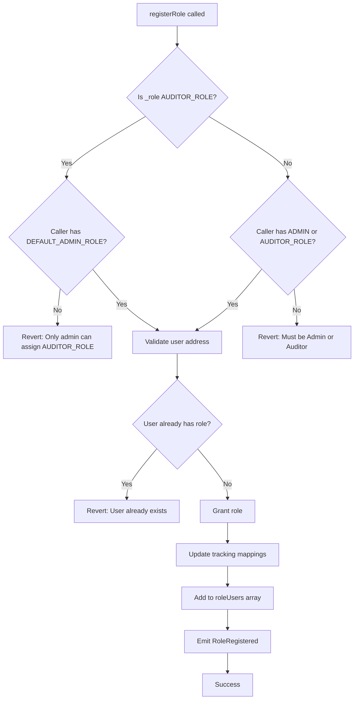

## Overview

The `Rol` abstract contract provides a comprehensive role-based access control (RBAC) system for Agora DAOs. It extends OpenZeppelin's `AccessControl` contract and adds custom role management, member tracking, and permission validation logic.

**Contract:** `AgoraDao/Rol.sol`  
**Type:** Abstract Contract  
**Inherits:** OpenZeppelin `AccessControl`

## Role Constants

The system defines four primary roles as `bytes32` constants:

```solidity
bytes32 internal constant AUDITOR_ROLE = keccak256("AUDITOR_ROLE");
bytes32 internal constant TASK_MANAGER_ROLE = keccak256("TASK_MANAGER_ROLE");
bytes32 internal constant PROPOSAL_MANAGER_ROLE = keccak256("PROPOSAL_MANAGER_ROLE");
bytes32 internal constant USER_ROLE = keccak256("USER_ROLE");
```

### Role Hierarchy

<ResponseField name="DEFAULT_ADMIN_ROLE" type="bytes32">
  **Inherited from AccessControl**  
  Highest privilege level - DAO creator/owner  
  Can assign AUDITOR_ROLE and revoke any role  
  Cannot be assigned to others (only admin can revoke roles)
</ResponseField>

<ResponseField name="AUDITOR_ROLE" type="bytes32">
  **Second-highest privilege**  
  Can assign TASK_MANAGER_ROLE, PROPOSAL_MANAGER_ROLE, and USER_ROLE  
  Only assignable by DEFAULT_ADMIN_ROLE  
  Used for DAO governance and oversight
</ResponseField>

<ResponseField name="TASK_MANAGER_ROLE" type="bytes32">
  **Management role**  
  Assignable by DEFAULT_ADMIN_ROLE or AUDITOR_ROLE  
  Manages task-related operations (when task system is implemented)
</ResponseField>

<ResponseField name="PROPOSAL_MANAGER_ROLE" type="bytes32">
  **Management role**  
  Assignable by DEFAULT_ADMIN_ROLE or AUDITOR_ROLE  
  Manages proposal-related operations (when proposal system is implemented)
</ResponseField>

<ResponseField name="USER_ROLE" type="bytes32">
  **Basic membership role**  
  Granted when users join a DAO  
  Represents regular DAO members
</ResponseField>

## State Variables

### Mappings

```solidity
mapping(bytes32 => address[]) private roleUsers;
mapping(bytes32 => mapping(address => bool)) private isMemberOfRole;
mapping(bytes32 => mapping(address => uint256)) private memberPosition;
```

<ResponseField name="roleUsers" type="mapping(bytes32 => address[])">
  Maps each role to an array of addresses holding that role  
  Enables enumeration of all members with a specific role
</ResponseField>

<ResponseField name="isMemberOfRole" type="mapping(bytes32 => mapping(address => bool))">
  Tracks whether an address is registered in a role's member list  
  Prevents duplicate entries in roleUsers array
</ResponseField>

<ResponseField name="memberPosition" type="mapping(bytes32 => mapping(address => uint256))">
  Stores the array index of each member in roleUsers  
  Enables O(1) removal of members from the array
</ResponseField>

## Functions

### registerRole

Assigns a role to a user with comprehensive permission checks.

```solidity
function registerRole(bytes32 _role, address _user) external
```

<ParamField path="_role" type="bytes32" required>
  The role identifier to assign (e.g., AUDITOR_ROLE, TASK_MANAGER_ROLE)
</ParamField>

<ParamField path="_user" type="address" required>
  The address to receive the role
</ParamField>

**Permission Requirements:**

- **For AUDITOR_ROLE**: Only DEFAULT_ADMIN_ROLE can assign
- **For other roles**: DEFAULT_ADMIN_ROLE or AUDITOR_ROLE can assign
- Caller cannot assign roles to themselves
- Cannot assign DEFAULT_ADMIN_ROLE

**Validation Checks:**

```solidity
require(_user != address(0), "User address cannot be zero");
require(_user != msg.sender, "Caller cannot assign role to self");
require(!isMemberOfRole[_role][_user], "User is already registered in this role's list");
require(!hasRole(_role, _user), "User already exists");
```

**Process:**
1. Validates permissions and inputs
2. Grants role via `_grantRole`
3. Marks user as member in `isMemberOfRole`
4. Adds user to `roleUsers` array
5. Records position in `memberPosition`
6. Emits `RoleRegistered` event

**Example:**

```solidity
// Admin assigns auditor role
dao.registerRole(AUDITOR_ROLE, auditorAddress);

// Auditor assigns task manager role
dao.registerRole(TASK_MANAGER_ROLE, managerAddress);
```

### registerRoleBatch

Assigns a role to multiple users in a single transaction.

```solidity
function registerRoleBatch(bytes32 _role, address[] calldata _users) external
```

<ParamField path="_role" type="bytes32" required>
  The role identifier to assign to all users
</ParamField>

<ParamField path="_users" type="address[]" required>
  Array of addresses to receive the role
</ParamField>

**Permission Requirements:**
- Same as `registerRole`
- **For AUDITOR_ROLE**: Only DEFAULT_ADMIN_ROLE
- **For other roles**: DEFAULT_ADMIN_ROLE or AUDITOR_ROLE

**Process:**
Iterates through the array and performs the same validation and assignment as `registerRole` for each user.

**Example:**

```solidity
address[] memory newMembers = new address[](3);
newMembers[0] = 0x123...;
newMembers[1] = 0x456...;
newMembers[2] = 0x789...;

// Assign USER_ROLE to multiple addresses
dao.registerRoleBatch(USER_ROLE, newMembers);
```

### deleteRole

Revokes a role from a user and removes them from tracking arrays.

```solidity
function deleteRole(bytes32 _role, address _user) external virtual
```

<ParamField path="_role" type="bytes32" required>
  The role identifier to revoke
</ParamField>

<ParamField path="_user" type="address" required>
  The address to revoke the role from
</ParamField>

**Permission Requirements:**
- Only DEFAULT_ADMIN_ROLE can revoke roles
- Caller cannot revoke their own role

**Validation:**

```solidity
require(_user != address(0), "User address cannot be zero");
require(_user != msg.sender, "Caller cannot revoke role from self");
require(hasRole(DEFAULT_ADMIN_ROLE, msg.sender), "Only admin can revoke roles");
require(isMemberOfRole[_role][_user], "User is not registered in this role's list");
require(hasRole(_role, _user), "User does not have this role");
```

**Process:**
1. Validates permissions and user status
2. Revokes role via `_revokeRole`
3. Marks user as not a member in `isMemberOfRole`
4. Removes user from `roleUsers` array using swap-and-pop technique
5. Updates position mapping for moved user
6. Deletes position entry for removed user
7. Emits `RoleDeleted` event

**Efficient Array Removal:**

```solidity
uint256 position = memberPosition[_role][_user];
uint256 lastPosition = roleUsers[_role].length - 1;
if (position != lastPosition) {
    address lastUser = roleUsers[_role][lastPosition];
    roleUsers[_role][position] = lastUser;
    memberPosition[_role][lastUser] = position;
}
roleUsers[_role].pop();
delete memberPosition[_role][_user];
```

**Example:**

```solidity
// Admin revokes task manager role
dao.deleteRole(TASK_MANAGER_ROLE, userAddress);
```

### getMemberByRole

Returns all addresses assigned to a specific role.

```solidity
function getMemberByRole(bytes32 _role) external view returns (address[] memory)
```

<ParamField path="_role" type="bytes32" required>
  The role identifier to query
</ParamField>

<ResponseField name="members" type="address[]">
  Array of all addresses holding the specified role
</ResponseField>

**Example:**

```solidity
// Get all auditors
address[] memory auditors = dao.getMemberByRole(AUDITOR_ROLE);

// Get all users
address[] memory users = dao.getMemberByRole(USER_ROLE);
```

### isRole

Checks if an address has a specific role.

```solidity
function isRole(bytes32 _role, address _user) external view returns (bool)
```

<ParamField path="_role" type="bytes32" required>
  The role identifier to check
</ParamField>

<ParamField path="_user" type="address" required>
  The address to check
</ParamField>

<ResponseField name="hasRole" type="bool">
  True if the address has the role, false otherwise
</ResponseField>

### getAllByRole

Alias for `getMemberByRole` - returns all addresses with a specific role.

```solidity
function getAllByRole(bytes32 _role) external view returns (address[] memory)
```

### _joinDaoUser (Internal)

Internal function for granting USER_ROLE when users join a DAO.

```solidity
function _joinDaoUser(address _user) internal
```

<ParamField path="_user" type="address" required>
  The address joining as a user
</ParamField>

**Process:**
1. Validates user is not already registered
2. Grants USER_ROLE
3. Updates tracking mappings and arrays
4. Emits RoleRegistered event with executor as address(0)

**Note:** This function is called by `AgoraDao.joinDao()` and bypasses the normal permission checks since it's part of the join flow.

## Events

### RoleRegistered

Emitted when a role is successfully assigned to a user.

```solidity
event RoleRegistered(bytes32 indexed role, address indexed user, address indexed executor);
```

<ResponseField name="role" type="bytes32" indexed>
  The role that was assigned
</ResponseField>

<ResponseField name="user" type="address" indexed>
  The address that received the role
</ResponseField>

<ResponseField name="executor" type="address" indexed>
  The address that performed the assignment (address(0) for _joinDaoUser)
</ResponseField>

### RoleDeleted

Emitted when a role is revoked from a user.

```solidity
event RoleDeleted(bytes32 indexed role, address indexed user, address indexed executor);
```

<ResponseField name="role" type="bytes32" indexed>
  The role that was revoked
</ResponseField>

<ResponseField name="user" type="address" indexed>
  The address that lost the role
</ResponseField>

<ResponseField name="executor" type="address" indexed>
  The admin address that performed the revocation
</ResponseField>

## Permission Matrix

| Action | Required Role | Can Assign/Revoke |
|--------|--------------|-------------------|
| Assign AUDITOR_ROLE | DEFAULT_ADMIN_ROLE | AUDITOR_ROLE |
| Assign TASK_MANAGER_ROLE | DEFAULT_ADMIN_ROLE or AUDITOR_ROLE | TASK_MANAGER_ROLE |
| Assign PROPOSAL_MANAGER_ROLE | DEFAULT_ADMIN_ROLE or AUDITOR_ROLE | PROPOSAL_MANAGER_ROLE |
| Assign USER_ROLE | DEFAULT_ADMIN_ROLE or AUDITOR_ROLE | USER_ROLE |
| Revoke any role | DEFAULT_ADMIN_ROLE | Any role |
| Join as user | Anyone (via joinDao) | USER_ROLE |

## Usage Example

```solidity
// Deploy a DAO (inherits from Rol)
AgoraDao dao = new AgoraDao(factoryAddress, adminAddress);

// Admin assigns an auditor
dao.registerRole(dao.AUDITOR_ROLE(), auditorAddress);

// Auditor assigns multiple task managers
address[] memory managers = new address[](2);
managers[0] = manager1;
managers[1] = manager2;
dao.registerRoleBatch(dao.TASK_MANAGER_ROLE(), managers);

// Get all auditors
address[] memory auditors = dao.getMemberByRole(dao.AUDITOR_ROLE());

// Check if address is auditor
bool isAuditor = dao.isRole(dao.AUDITOR_ROLE(), someAddress);

// Admin removes a task manager
dao.deleteRole(dao.TASK_MANAGER_ROLE(), manager1);

// User joins the DAO (internal _joinDaoUser is called)
dao.joinDao(); // Automatically grants USER_ROLE
```

## Access Control Flow



## Security Considerations

1. **Self-Assignment Prevention**: Users cannot assign roles to themselves
2. **Admin Protection**: DEFAULT_ADMIN_ROLE cannot be reassigned or removed through registerRole
3. **Self-Revocation Prevention**: Users cannot revoke their own roles
4. **Duplicate Prevention**: Checks prevent adding users to role arrays multiple times
5. **Zero Address Protection**: Rejects zero address for all role operations
6. **Permission Hierarchy**: Enforces strict permission requirements for role assignment