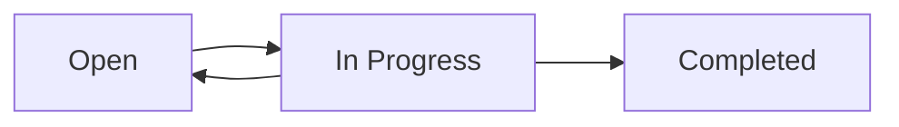

## Overview

Agora DAO includes a task management system that allows DAOs to coordinate work, assign responsibilities, and track contributions. The task system is currently implemented in the frontend as a foundation for future on-chain task escrow and payment mechanisms.

<Note>
The task management feature is in active development. The current implementation provides a UI framework for task coordination, with on-chain escrow and automated payments planned for future releases.
</Note>

## Task structure

Tasks in Agora DAO contain the following attributes:

<ParamField path="id" type="string" required>
  Unique identifier for the task
</ParamField>

<ParamField path="title" type="string" required>
  Brief, descriptive title of the task (e.g., "Audit Smart Contracts v2")
</ParamField>

<ParamField path="description" type="string" required>
  Detailed description of what needs to be accomplished
</ParamField>

<ParamField path="reward" type="string" required>
  Compensation for completing the task (e.g., "500 USDC")
</ParamField>

<ParamField path="status" type="enum" required>
  Current state: `open`, `in-progress`, `completed`
</ParamField>

<ParamField path="category" type="string" required>
  Type of work (e.g., "Development", "Design", "Content")
</ParamField>

<ParamField path="priority" type="enum" required>
  Urgency level: `low`, `medium`, `high`
</ParamField>

<ParamField path="deadline" type="string" required>
  Time remaining or completion date
</ParamField>

## Task lifecycle

Tasks follow a standard workflow through different states:



### Task states

<Steps>
  <Step title="Open">
    Task is available for claiming. Any qualified member can start work on it.
  </Step>
  <Step title="In progress">
    A member has claimed the task and is actively working on it.
  </Step>
  <Step title="Completed">
    Work has been submitted, reviewed, and approved. Payment has been released.
  </Step>
</Steps>

## Task categories

Agora DAO supports various task categories to organize different types of work:

<CardGroup cols={3}>
  <Card title="Development" icon="code">
    Smart contract development, frontend work, integrations
  </Card>
  <Card title="Design" icon="palette">
    UI/UX design, branding, graphics, user flows
  </Card>
  <Card title="Content" icon="pen-nib">
    Documentation, articles, research reports, tutorials
  </Card>
  <Card title="Marketing" icon="megaphone">
    Community outreach, social media, campaigns
  </Card>
  <Card title="Research" icon="flask">
    Technical research, market analysis, feasibility studies
  </Card>
  <Card title="Operations" icon="gears">
    Administrative tasks, coordination, process improvement
  </Card>
</CardGroup>

## Current implementation

The frontend provides a task management interface with filtering and search capabilities:

```typescript TaskSection.tsx
const MOCK_TASKS = [
  {
    id: "1",
    title: "Auditoría de Smart Contracts v2",
    description: "Revisión exhaustiva de la nueva implementación de gobernanza para detectar posibles vulnerabilidades.",
    reward: "500 USDC",
    status: "open" as const,
    category: "Desarrollo",
    priority: "high" as const,
    deadline: "5 días",
  },
  {
    id: "2",
    title: "Rediseño de Landing Page",
    description: "Actualizar la interfaz de usuario principal siguiendo las nuevas guías de marca de la DAO.",
    reward: "350 USDC",
    status: "in-progress" as const,
    category: "Diseño",
    priority: "medium" as const,
    deadline: "12 días",
  },
];
```

### Task UI features

The current task interface includes:

- **Search functionality**: Find tasks by keywords
- **Status filtering**: Filter by open, active, or completed tasks
- **Priority indicators**: Visual badges for high/medium/low priority
- **Category organization**: Group tasks by work type
- **Responsive cards**: Mobile-friendly task display

```typescript TaskSection.tsx
<div className="flex flex-col md:flex-row gap-4 items-center">
  <div className="relative w-full md:max-w-sm">
    <Search className="absolute left-3 top-1/2 -translate-y-1/2 h-4 w-4 text-muted-foreground" />
    <Input placeholder="Buscar tareas..." className="pl-10" />
  </div>
  <Tabs defaultValue="all" className="w-full md:w-auto">
    <TabsList className="grid grid-cols-4 w-full md:w-auto">
      <TabsTrigger value="all">Todas</TabsTrigger>
      <TabsTrigger value="open">Abiertas</TabsTrigger>
      <TabsTrigger value="active">Activas</TabsTrigger>
      <TabsTrigger value="done">Hechas</TabsTrigger>
    </TabsList>
  </Tabs>
</div>
```

## Role-based task permissions

Task management respects the DAO's role system:

### TASK_MANAGER_ROLE permissions

Members with `TASK_MANAGER_ROLE` can:
- Create new tasks
- Assign tasks to specific members
- Set task deadlines and priorities
- Approve task deliveries
- Manage task budgets and rewards

### USER_ROLE permissions

Members with `USER_ROLE` can:
- View all open tasks
- Claim available tasks
- Submit work for review
- Track their active tasks
- View task history

<Info>
Task managers are assigned by DAO admins using the role management system. See the [role management documentation](/features/role-management) for details.
</Info>

## Planned on-chain features

Future versions will include smart contract-based task management:

### Task escrow system

```solidity Planned feature
struct Task {
    uint256 taskId;
    address creator;
    address assignee;
    uint256 reward;
    uint256 deadline;
    TaskStatus status;
    string metadataURI;
}

enum TaskStatus {
    Open,
    Assigned,
    InReview,
    Completed,
    Disputed
}
```

### Escrow mechanism

When a task is created:
1. Task manager deposits reward tokens into escrow
2. Funds are locked until task completion or dispute
3. Worker claims the task and begins work
4. Upon approval, funds automatically release to worker

### Payment release flow

<Steps>
  <Step title="Task creation">
    Task manager creates task and funds escrow contract
  </Step>
  <Step title="Task assignment">
    Worker claims task or is assigned by manager
  </Step>
  <Step title="Work submission">
    Worker completes task and submits for review
  </Step>
  <Step title="Review period">
    Task manager reviews deliverables (e.g., 48 hours)
  </Step>
  <Step title="Automatic release">
    If approved or review period expires, funds release to worker
  </Step>
</Steps>

<Warning>
The on-chain task escrow feature is not yet implemented. The current task system operates off-chain with manual payment coordination.
</Warning>

## Task creation workflow

The intended workflow for creating tasks:

1. **Define scope**: Clearly outline what needs to be done
2. **Set reward**: Determine fair compensation in USDC/ETH/DAO tokens
3. **Assign priority**: Mark urgency level (high/medium/low)
4. **Set deadline**: Establish realistic completion timeframe
5. **Add details**: Include requirements, deliverables, acceptance criteria
6. **Fund escrow**: Deposit reward amount (planned feature)
7. **Publish task**: Make available to DAO members

## Task assignment strategies

DAOs can choose different assignment approaches:

### Open claiming
Any qualified member can claim available tasks first-come-first-served. Best for:
- Simple, well-defined tasks
- Building contributor pipeline
- Encouraging broad participation

### Direct assignment
Task manager assigns specific members based on skills. Best for:
- Complex or sensitive work
- Tasks requiring specific expertise
- Time-critical deliverables

### Application-based
Members apply with proposals; best candidate selected. Best for:
- High-value tasks
- Multiple qualified candidates
- Tasks requiring detailed planning

## Integration with rewards

Task completion integrates with the DAO's reward system:

- **Token rewards**: USDC, ETH, or custom DAO tokens
- **NFT badges**: Achievement tokens for completed tasks
- **Reputation points**: On-chain reputation building
- **Contributor levels**: Unlock higher-value tasks

See the [rewards documentation](/features/rewards) for more details on compensation.

## Best practices

<CardGroup cols={2}>
  <Card title="Clear requirements" icon="list-check">
    Define specific deliverables and acceptance criteria upfront
  </Card>
  <Card title="Fair compensation" icon="scale-balanced">
    Research market rates and ensure competitive rewards
  </Card>
  <Card title="Realistic deadlines" icon="clock">
    Allow adequate time for quality work and review cycles
  </Card>
  <Card title="Regular communication" icon="messages">
    Maintain open dialogue between managers and workers
  </Card>
</CardGroup>

## Frontend access

DAO members can access task management at:

```
/task
```

The page includes:
- Task grid with cards for each task
- Search and filter functionality
- "Propose Task" button for managers
- Task details and claiming interface

## Example task card

The UI displays tasks as interactive cards:

```typescript TaskCard.tsx
<Card>
  <CardHeader>
    <div className="flex items-start justify-between">
      <CardTitle>{title}</CardTitle>
      <Badge variant={priorityVariant}>{priority}</Badge>
    </div>
    <CardDescription>{description}</CardDescription>
  </CardHeader>
  <CardContent>
    <div className="space-y-2">
      <div className="flex justify-between text-sm">
        <span>Reward:</span>
        <span className="font-semibold">{reward}</span>
      </div>
      <div className="flex justify-between text-sm">
        <span>Deadline:</span>
        <span>{deadline}</span>
      </div>
    </div>
  </CardContent>
  <CardFooter>
    <Button>Claim Task</Button>
  </CardFooter>
</Card>
```

## Next steps

<CardGroup cols={2}>
  <Card title="Role management" icon="user-shield" href="/features/role-management">
    Learn how to assign TASK_MANAGER_ROLE
  </Card>
  <Card title="Rewards" icon="coins" href="/features/rewards">
    Understand reward systems for task completion
  </Card>
  <Card title="DAO membership" icon="users" href="/features/dao-membership">
    See how members can join to start claiming tasks
  </Card>
</CardGroup>
